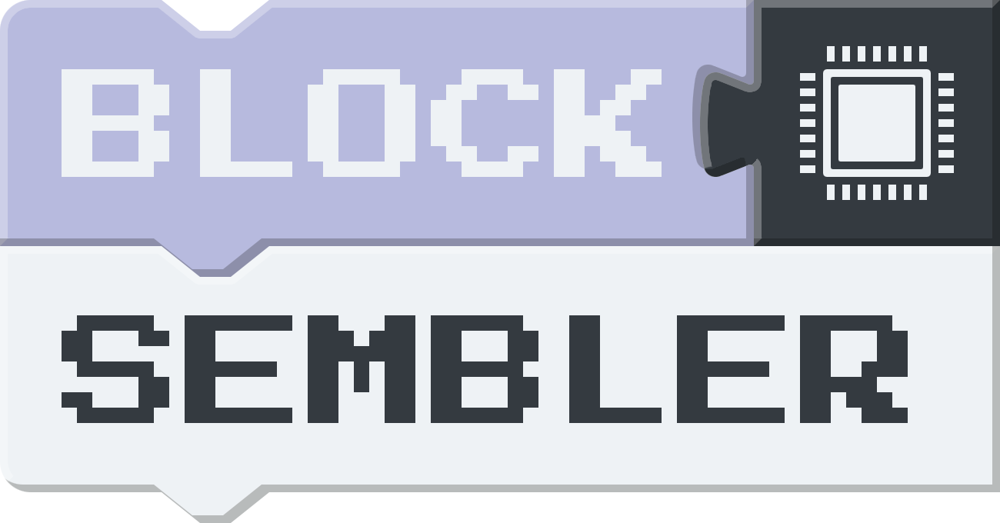

## 

## Getting Started

### Run from Source

To get started with the Assembler Programming Learning Environment, follow these steps:

1. **Clone the Repository**: Clone this repository to your local machine using `git clone https://github.com/Blocksembler/blocksembler-frontend.git`.

2. **Install Dependencies**: Navigate to the project directory and install the necessary dependencies by running `npm install`.

3. **Run the Development Server**: Start the development server by running `npm run dev`. This will launch the application locally, and you can access it in your web browser at [http://localhost:5173](http://localhost:5173).

4. **Explore and Learn**: Start exploring the block-based programming environment and dive into learning assembler programming with ease!

### Run from Docker Image

Blocksembler is also available on [Docker Hub](https://hub.docker.com/r/blocksembler/blocksembler-frontend/tags). To get started, follow these steps:

1. **Pull Docker Image**: Pull the blocksembler/blocksembler-frontend image `docker pull blocksembler/blocksembler-frontend:latest`

2. **Run the Container**: Startup a new container instance that runs the blocksembler application `docker run blocksembler/blocksembler-frontend:latest -p 80:80 -d`. This will launch the application locally, and you can access it in your web browser at [http://localhost](http://localhost:5173).

3. **Explore and Learn**: Start exploring the block-based programming environment and dive into learning assembler programming with ease!

## Contributing

Contributions to this project are welcome! If you have ideas for new features, improvements, or bug fixes, feel free to open an issue or submit a pull request.

## Contact

Florian Wörister | Universität Wien
