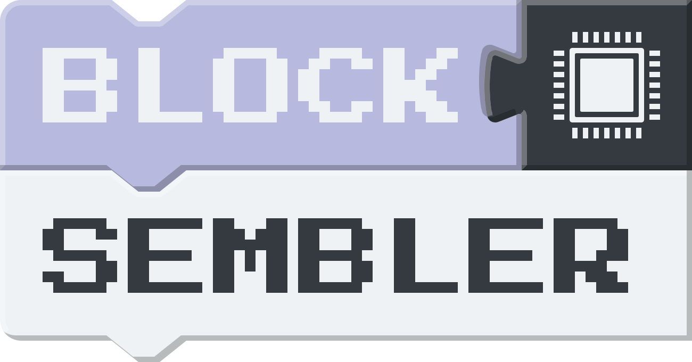

## 

## Getting Started

To get started with the Assembler Programming Learning Environment, follow these steps:

1. **Clone the Repository**: Clone this repository to your local machine using `git clone https://github.com/Blocksembler/blocksembler-frontend.git`.

2. **Install Dependencies**: Navigate to the project directory and install the necessary dependencies by running `npm install`.

3. **Run the Development Server**: Start the development server by running `npm run serve`. This will launch the application locally, and you can access it in your web browser at `http://localhost:8080`.

4. **Explore and Learn**: Start exploring the block-based programming environment and dive into learning assembler programming with ease!

## Contributing

Contributions to this project are welcome! If you have ideas for new features, improvements, or bug fixes, feel free to open an issue or submit a pull request.

## Contact

Florian Wörister | University of Vienna | Faculty of Computer Science
